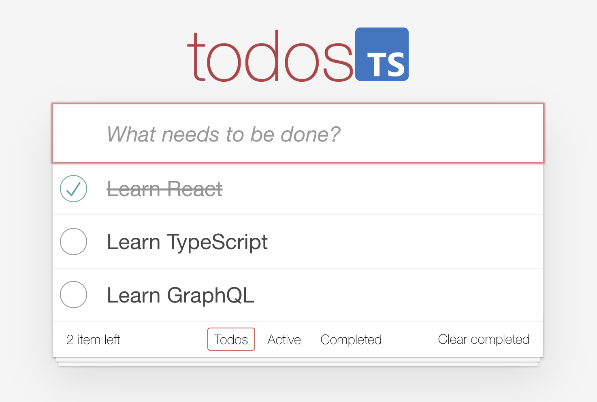

#  📝Todo App with React-TS

<!--  -->
<div align="center" style="padding: 40px;">    
    
</div>

A simple Todo List application built with React and TypeScript.

## Table of Contents

- [Features](#features)
- [Installation](#installation)
- [Usage](#usage)
- [Directory](#directory)

## Features

- Add, edit, and remove tasks.
- Mark tasks as completed or uncompleted.
- Filter tasks based on their completion status.
- Responsive design for mobile and desktop screens.
- Built with React and TypeScript for type-safe development.
- Bundled using Vite for fast and efficient development.

## Installation

Before you start, make sure you have [Node.js](https://nodejs.org/) and [Yarn](https://yarnpkg.com/) installed.

1. Clone this repository to your local machine:

```bash
git clone https://github.com/PauVelasco77/todo-app-ts.git
cd todo-app-ts
``````

2. Install the project dependencies:

```bash
yarn
```

## Usage

1. To start the development server, use the following command:

```bash
yarn dev
```

This will start the development server at http://localhost:5173.

To build the production-ready version, run:

```bash
yarn prod
```

## Directory
```bash
.
├── README.md
├── index.html
├── package.json
├── public
│   └── vite.svg
├── src
│   ├── App.tsx
│   ├── assets
│   │   ├── react.svg
│   │   └── todo-photo.png
│   ├── components
│   │   ├── CreateTodo.tsx
│   │   ├── Filters.tsx
│   │   ├── Footer.tsx
│   │   ├── Header.tsx
│   │   ├── Todo.tsx
│   │   └── Todos.tsx
│   ├── consts.ts
│   ├── index.css
│   ├── main.tsx
│   ├── types.d.ts
│   └── vite-env.d.ts
├── tsconfig.json
├── tsconfig.node.json
├── vite.config.ts
└── yarn.lock
```

